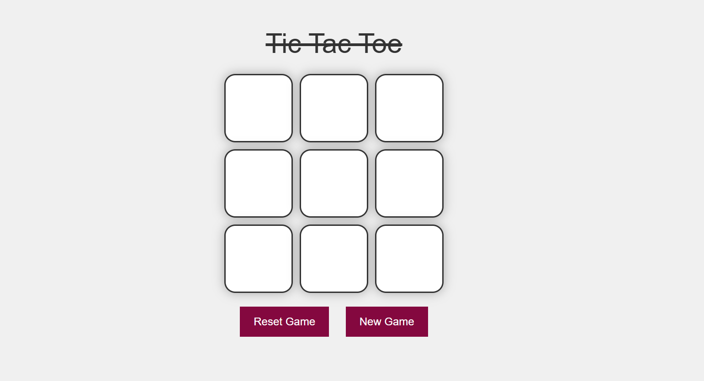

<h3>This is a simple Tic Tac Toe game built using HTML, CSS, and JavaScript.<h3>
    <h4>Play against another player locally in a fun and interactive game interface.</h4>

 <h3>*Features</h3>
    
Two-player mode

    
Simple & clean UI

    
Highlight winning combination

    
Restart the game easily

 <h3>*Tech Used</h3>
    
HTML5

    
CSS3

    
JavaScript (Vanilla JS)

<h3>✍️Author</h3> 
    <h5>Abhay Shukla</h5>
